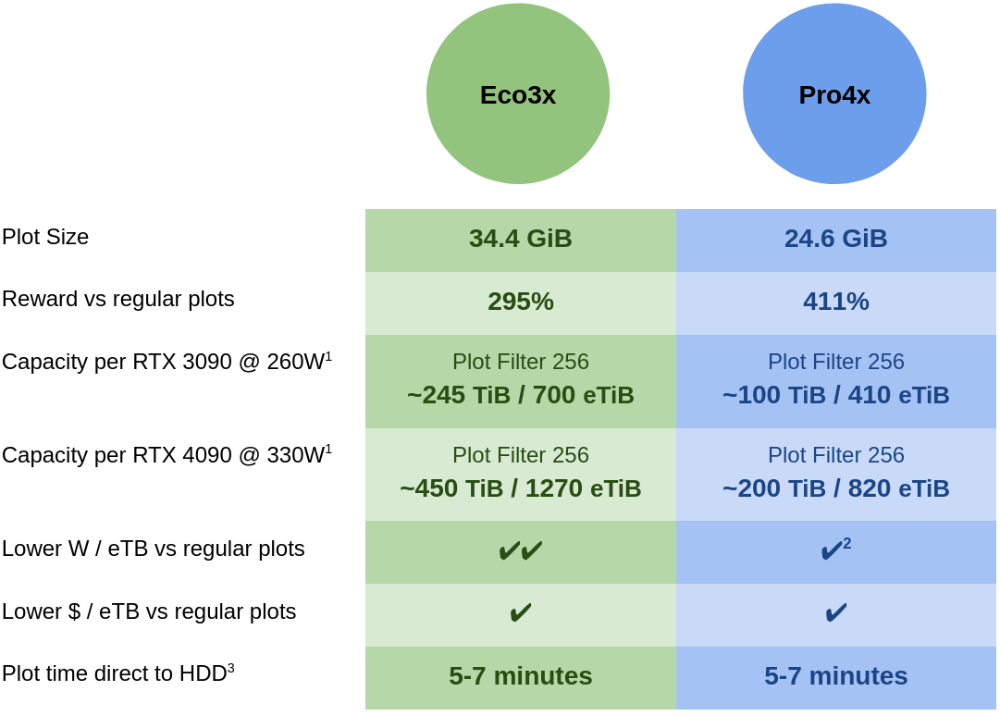
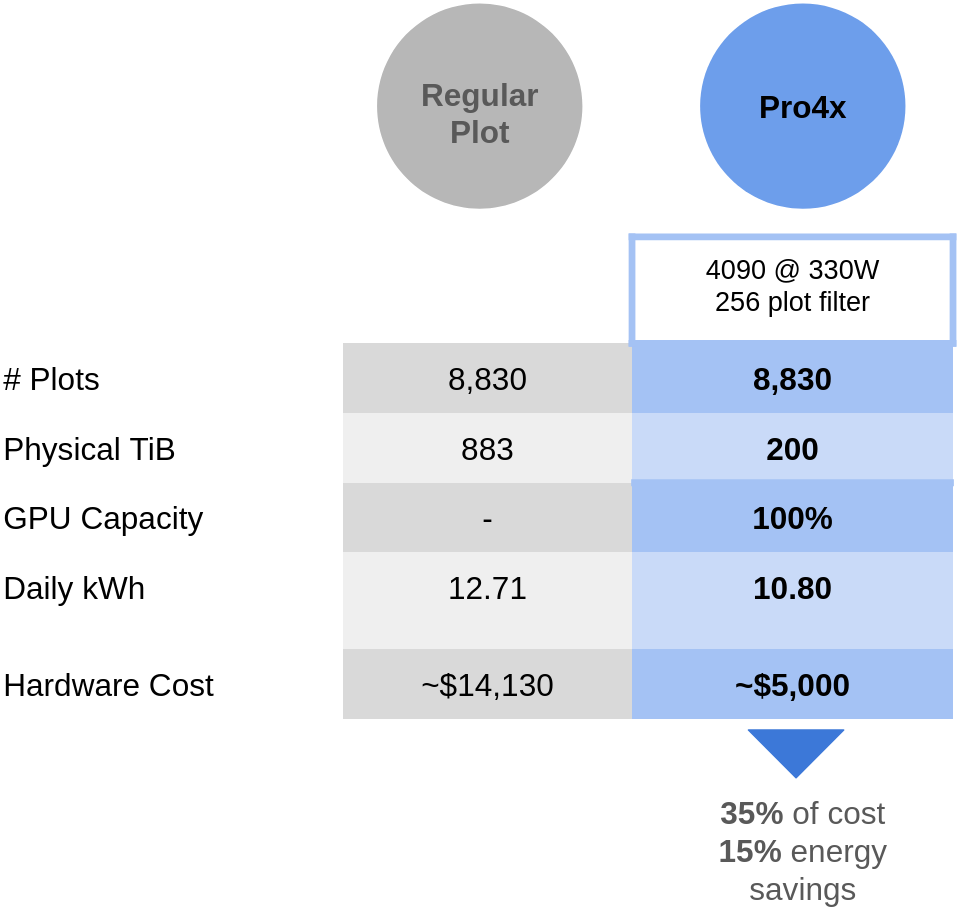
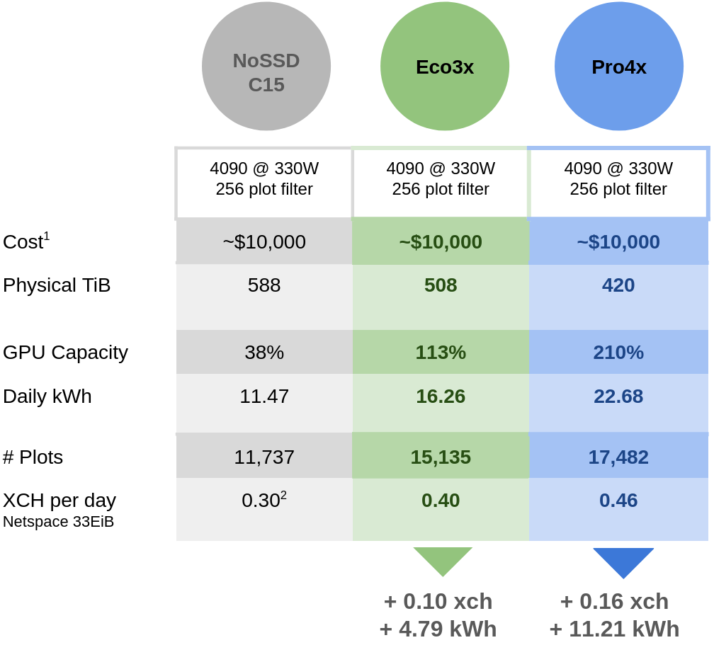
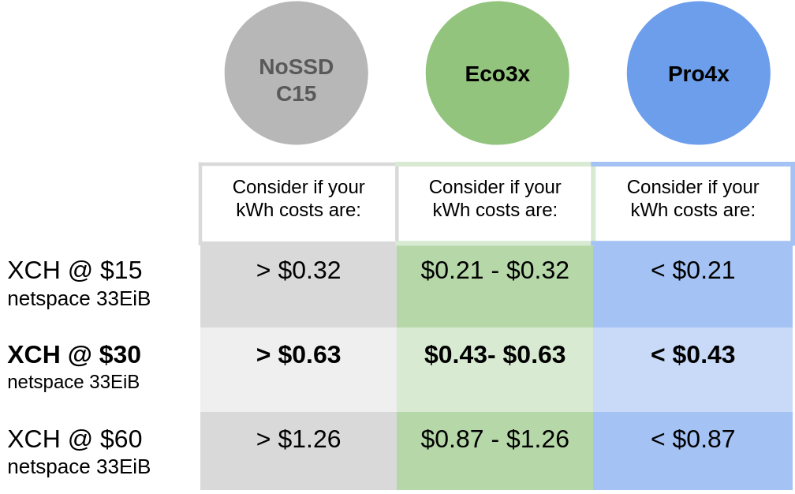

# DrPlotter: Your Go-To for Maximum ROI Chia Farming

DrPlotter is an advanced, energy-efficient GPU plotter, solver, and harvester designed for the Chia Blockchain, with break-through rewards and efficiency optimized for consumer-grade hardware. See the video on the [Introduction to DrPlotter](https://www.youtube.com/watch?v=hQTV7foIRHo&t=3s).

- **Up to +413% Rewards**: Two compression modes offer a balance between optimal efficiency and optimal cost per eTB for maximum ROI.
- **Enhanced Security**: Relies solely on public farmer keys, letting you safeguard your private keys.
- **Effortless Remote GPU Use**: Enjoy a streamlined process for submitting proofs and the flexibility to use your GPU remotely with ease.
- **Supporting the Chia Ecosystem**: By seamlessly integrating with the official Chia Farmers, DrPlotter plays a part in keeping the Chia network strong and decentralized.

Offering Eco3x for enhanced energy efficiency and Pro4x for maximum plot size reduction you can achieve higher ROI than any other solution.

<p align="center" alt="DrPlotter eco3x and pro4x summary">
  
</p>

<sup>1: The 512 plot filter will be active until June 2024. During this period, the capacities supported by the 256 filter will be doubled.</sup>
<sup>2: At a plot filter of 256 only the 4090 has less W/eTB than standard plots on pro4x.</sup>
<sup>3: **SSD not required.** While you can use an SSD as an intermediary drive under most cases it will not improve plot time. 4090 @ 250W with PCIE 4.0 x 16 can plot in 5:30.</sup>

## The Eco3x Advantage

Eco3x compression offers an energy-efficient solution for managing chia farms, especially with the upcoming chia plot filter of 256. The table below illustrates Eco3x's efficiency compared to traditional uncompressed plots. Eco3x significantly reduces hard drive space and energy consumption, leading to considerable savings in both hardware investment and operational costs. This makes it a highly effective option for Chia users, even those facing high energy expenses, to achieve exceptional ROI.

<p align="center" alt="Table comparing eco3x advantages to regular plots">
  
</p>

<sub>1: Using 0.6W per installed TB</sub>
<sub>2: The "Hardware Cost per ePiB" represents the actual costs of purchasing the necessary hardware for disks and GPUs. This is based on an estimated $16 per installed TB and $800 for a used 3090 GPU</sub>

## The Pro4x Advantage

Pro4x compression significantly reduces hard drive needs for your plots to less than a quarter compared to uncompressed plots, marking a major leap in cost and space savings. By matching your hard drive capacity with your GPU's power, Pro4x achieves unmatched ROI. The table shows that with 4090 GPUs at full capacity, even with the challenging 256 plot filter, you can efficiently run a 1.6 ePiB farm at just 38% the cost of a setup using regular plots. Notably, Pro4x enables over 1 ePiB of plots in a consumer PC case using only 14 hard drives, compared to the 56 drives a large server setup would need, enhancing space utilization, cost-effectiveness, and management simplicity.

<p align="center" alt="Table comparing pro4x advantages to regular plots">
  
</p>
<sub>1: Using 0.6W per installed TB</sub>
<sub>2: The "Hardware Cost per ePiB" represents the actual costs of purchasing the necessary hardware for disks and GPUs. This is based on an estimated $16 per installed TB and $1800 for a new 4090 GPU</sub>

## Strategic Efficiency: Eco3x and Pro4x vs. NoSSD's C15
In the competitive landscape of chia farming, striking the right balance between energy consumption and cost per reward is key. Chia farming involves substantial initial setup costs but low ongoing expenses. The Eco3x and Pro4x solutions, developed with these economic dynamics in mind, optimize for a slight increase in energy use to significantly reduce the cost per reward across various setups and market conditions, offering a financial advantage.

The performance of these solutions is contrasted with NoSSD's leading C15 plot format under a fixed $10,000 budget. Analysis shows that both Eco3x and Pro4x not only improve chia earnings but do so with an acceptable increase in energy consumption. Specifically, Eco3x delivers an extra 0.10 xch for 4.79 kWh more than C15, while Pro4x adds 0.16 xch for an additional 11.21 kWh.

<p align="center" alt="DrPlotter Eco3x and Pro4x vs NoSSD C15">
  
</p>

<sub>1: Hardware Cost includes expenses for disks and GPUs, calculated at $16 per installed TB and $1600 for a 4090 GPU. GPU costs are adjusted to utilization—e.g., at 38% utilization, only 38% of the GPU cost is counted. This approach ensures costs are proportionally represented for a fair comparison within a $10,000 investment.</sub>
<sub>2: For NoSSD a 3.5% is deducted from rewards. Since DrPlotter fees are already incorporated into it's structure there's no need for any additional deductions.</sub>

By evaluating the potential xch price against energy costs, it's clear that Eco3x and Pro4x are compelling for those seeking profitability over minimal energy use. For example, if your electricity costs are $0.14 per kWh with XCH priced at $30:

```
Eco3x extra earnings - extra energy costs = 0.10 * $30 - 4.79 * $0.14  = +$2.33 vs NoSSD.
Pro4x extra earnings - extra energy costs = 0.16 * $30 - 11.21 * $0.14 = +$3.23 vs NoSSD.
```
These figures highlight Pro4x as a strong contender, offering a 44% higher daily return than NoSSD's C15 ($10.62 per day vs $7.39 per day), despite a higher energy consumption.

To enhance your decision-making process, the chart below serves as a guide for evaluating risks and potential returns. For those who prefer a cautious approach, opt for a plot format that remains viable at lower XCH prices. 

<p align="center" alt="DrPlotter Eco3x and Pro4x vs NoSSD C15">
  
</p>

> [!IMPORTANT]  
> The chart provided is tailored to reflect scenarios involving the use of 4090 GPUs, as detailed in the hardware setup section above.

## Get the Most Out of Your GPU with Eco3x and Pro4x

Eco3x and Pro4x plots let you use your hard drive space and GPU power to the fullest. By allocating Eco3x and Pro4x across your HDDs based on how much space you have, you make sure your GPU is always busy, with no downtime.

**For example:**
- you have 335 TiB of storage space and a 3090 GPU, at the current plot filter of 512.

**How to Do It:**
- Use 235 TiB for Eco3x plots. This keeps 50% of your 3090 GPU busy.
- Fill the remaining 100 TiB with Pro4x plots. This uses up the other 50% of your GPU.

**The Outcome:** 
This mix lets you use all of your storage space wisely, filling it with Eco3x and Pro4x plots. You end up with a total plot size of about 1.1 ePiB (3x the size of your Eco3x space and 4x your Pro4x space). Your GPU is always active, making sure you're using your resources efficiently.


## About the Developer and Contribution Structure

DrPlotter has been a labor of love and dedication that has captivated my attention for over two years. What began as a passion project has transformed into a committed effort to advance the field of Chia plot compression and support the strengths of the Chia blockchain.

To continue this journey, I've stepped away from incorporating a randomized fee or possibly changing fee on farming revenue. Instead, each DrPlot you create contains a small set of developer proofs, which will occasionally be solved just like one of your own proofs. However, these solved developer proofs are then directed to my farmer to create the block, and not yours. Most importantly, all the performance stats I present already factor in these contributions – ensuring that there are no hidden costs. What you see is precisely what you get. This contribution structure is steadfast and unchanging, ensuring that the results you see now will remain consistent in the future. This stability offers ease in planning and peace of mind. A more detailed overview how this works can be seen in the video section: [Note on Developer Fees](https://www.youtube.com/watch?v=hQTV7foIRHo&t=559s)


# How it works

<p align="center" alt="Diagram of DrPlotter components">
  
</p>


**DrPlotter** is the plotting tool that creates Eco3x and Pro4x plots. Given your farmer and pool public keys, it produces "DrPlots" using write-once technology directly to your HDD, typically in 5-7 minutes per plot. No SSD required.

**DrChia harvester**, in line with the Chia harvesting protocol, seamlessly integrates with your existing farmer setup. It reads existing chia supported plots and your new DrPlots. DrPlot entries requiring proof solving are sent to the Solver Server. Once solved, these proofs are relayed back to the DrChia harvester and then passed onto your Chia farmer, ensuring smooth and consistent operation.

**DrSolver** leverages your GPU power to solve proofs for your plot entries. Using a unique token system, DrSolvers can be deployed in various locations without compromising efficiency or security.

**Solver Server** is vital in enhancing computational efficiency and consistently reducing proof times. It alleviates bottlenecks and manages load during peak periods at signage points for your DrPlots by proportionally allocating compute resources according to DrPlot count, ensuring efficient and equitable proof resolution across the network.

For a more complete overview, see the video [How it works](https://www.youtube.com/watch?v=hQTV7foIRHo&t=463s).


# Using DrPlotter

- Make sure you meet the [minimum requirements](#minimum-requirements)
- Download and [install the software](#installation)
- [Start plotting](#plotting) with the DrPlotter tool.
- [Set your client token](#setting-up-your-drplotter_client_token)
- [Run your DrSolvers](#run-your-drsolver)
- [Setup and run your DrChia harvester](#setup-and-run-your-drchia-harvester) with your existing chia farmer.
- [Verify your DrPlots are submitting proofs](#verify-your-drplots-are-submitting-proofs)

## Minimum Requirements
DrPlotter Minimum Requirements:
- 24GB nvidia 3090 / A5000 / 4090
- 128GB DDR4 RAM
- motherboard with a PCIE 4.0 x 16 slot
- 64 bit processor (onboard GPU a bonus)
- Ubuntu / Debian based system

DrSolver Minimum Requirements:
- 24GB nvidia 3090.
- Ubuntu / Debian based system

DrChia Harvester Minimum Requirements:
- ~4GB RAM for every 1PiB of raw disk space.
- Ubuntu / Debian based system

## Installation

Make sure you meet the minimum requirements above. Then, download the latest .deb package from the releases page.

In the command line, run dpkg on your downloaded file, for example:

```
sudo dpkg -i drplotter_0.10.0_amd64.deb 
```

This will install drplotter, drsolver, and drchia for the harvester in the /usr/bin/ directory.

You'll also need to install the protobuf library for drsolver:

```
sudo apt-get install libprotobuf23
```

If at any point you want to remove drplotter, to uninstall run:

```
sudo dpkg -r drplotter
```

## Plotting
> [!NOTE]
> DrPlotter only supports the recommended NFT plots with pooling. This is to ensure you can verify your system is running as expected against proofs submitted to pools. You can still choose to solo pool, but it must be a plot NFT and not the OG format.

To make plots, run:

```
drplotter plot -f <your_farmer_key> -c <your_pool_contract_address> -d /your/hdd/directory/ --compression <eco3x or pro4x>
```

This will fill the directory with plots. While plotting, you'll see progress and when plots complete, you'll see output like this:

```
Location: 
  Path: /media/nick/E14TB_14/drplots/
  Usage: 1.76 TB used of 12.73 TB total (13%)
  Est. Completion: 467 plots by 2024-01-26 09:25 (2 days, 8 hours)

Plotting File: drplot-pro4x-2024-01-24-00-35-372b8c5b9948587dcf4e6b66565cd382.drplot

  Progress          Time    ETA
  -----------------------------
  100% ##########  06:51      -

  Size       : 24.01 GiB                   1
  Proofs     : 4.180.621.852
  Bits/proof : 49.33 (24.33% of original size)

============ 2024-01-24 00:43:42 ============
```
Bits/proof is the most important metric for compression. A standard k32 chia plot will require around 202.8 bits for each proof it stores. By comparing bits per proof, we can accurately see the compression based on the number of proofs a plot has, and not just it's physical size.

To see more plotting options, run:
```
drplotter -h
```

## Setting up your DRPLOTTER_CLIENT_TOKEN

DrPlotter requires a unique client token for authentication. This token links your drsolvers and harvesters. **Use the same token** across all your machines running drchia harvesters and drsolvers.

### 1. Generate your token

Run the following command to generate a new client token:
```
drsolver --generate-token
```
This command creates a new authentication token. You'll see output similar to this (note that your token will be different):

```
Generated client token: kWq9NXkHQ75zGhebkJzriknBs0IOnDux5kIqOd0aJioM6HSR
```
 
### 2. Set your DRPLOTTER_CLIENT_TOKEN environment variable
- **Temporary Setting**: For a temporary setup in a bash shell, use:
     
    ```
    export DRPLOTTER_CLIENT_TOKEN='Your_Unique_Token'
    ```
    Replace 'Your_Unique_Token' with the token generated in the previous step.
- **Persistent Setup:**

  Edit your `.bashrc` file for a more persistent solution:
  ```
  nano ~/.bashrc
  ```
  Add the following line to the end of the file (with your actual token):
  ```
  export DRPLOTTER_CLIENT_TOKEN='Your_Unique_Token'
  ```
  Save and exit, then apply changes with:
  ```
  source ~/.bashrc
  ```

### 3. Verify your token is set
To verify that your token is set correctly, you can run:
```
echo $DRPLOTTER_CLIENT_TOKEN
```
and check that the output matches your token.

> [!CAUTION]
> Keep your token secure and do not share it in public forums


## Run your DrSolver

Once your DRPLOTTER_CLIENT_TOKEN is set in your environment (see [previous section](#setting-up-your-drplotter_client_token)), run:
```
drsolver
```
DrSolver will run and connect to Solver Server. Once connected, it will display your connected harvesters and solvers that are linked using the same client token. Below is an example output:

```
                            DrPlotter Solver v0.10.0

DrPlotter Farm Status
--------------------------------------------------------------------------------
  Status: CONNECTED                                             Uptime: 02:23:30
  Client Token: kWq9NXkHQ75zGheb...

  Total Harvesters: 2                                           Total Solvers: 1

  Num DrPlots        Raw Size           Effective Size     Extra Rewards
  3911               95.80 TiB          376.20 TiB         +393%


Solver GPU: NVIDIA GeForce RTX 3090
--------------------------------------------------------------------------------
  Fan    Temp   Perf   Pwr:Usage/Cap                                Memory-Usage
  30%    61C    P2     237W / 240W                           23346MiB / 24576MiB

  Status                                            Load  1 min / 5 min / 15 min
  SOLVING                                                    14%  /  34%  /  32%


Commands: [Q]uit
```

While DrSolver is running, monitor the 5-minute and 15-minute "load" indicators to gauge the current capacity usage of your GPU as a percentage of its total capacity. 

## Setup and Run your DrChia Harvester
 
On your harvester system, set the DRPLOTTER_CLIENT_TOKEN environment variable to the one you [generated with your DrSolver](#setting-up-your-drplotter_client_token).

### System with Existing Chia Harvester

> [!IMPORTANT]
> Chia Network recently released new update 2.2.x that breaks changes in the harvester<->farmer protocol and config.yaml files. If you have trouble with this section on an existing chia harvester, remove your ~/.chia/ directory and setup again using drchia init instead as explained in the next section.
 
If you already have a chia setup for your system, you can simply run:

```
drchia start harvester -r
```

Make sure to include the -r to stop any previous harvesters and replace them with the drchia harvester.


### New System as Remote Harvester

> [!IMPORTANT] 
The latest chia farmer 2.2.x has breaking changes in the harvester<->farmer protocol. You must stay on a chia farmer 2.1.x in order for `drchia harvester` to connect.

Currently, you need a chia farmer/node on a seperate machine or VM, and connect to it remotely using `drchia`. On the machine for your `drchia` harvester, first run:

   ```
   drchia init
   ```

- Then, you need to copy in your ca certificates from your **farmer machine**, these are usually found at `~/.chia/mainnet/config/ssl/ca`. Initialize these with your harvester:

   ```
   drchia init -c /path/to/your/farmers/ca/certificates
   ```

- Edit the chia config file on your harvester.

   ```
   ~/.chia/mainnet/config/config.yaml
   ```
 
   Look for **farmer_peer:** under the **harvester:** section, and edit the ip to point to your farmer ip.
    e.g.
    ``` 
    harvester:
      farmer_peer:
        host: <Farmer IP Address>  <--- set to your farmer ip address, e.g. 192.168.1.23
        port: 8447
    ```
   Don't forget to save your changes.

Add any new plot directories you've plotted, as you would with chia's software, e.g.:

```
drchia plots add -d /your/plots/directory
```

Before you run your harvester, let's change the config so that you can see log outputs to check it's working. Run:

```
drchia configure --log-level INFO
```
And now run:

```
drchia start harvester -r
```

If all is well, you can now check your logs in ~/.chia/mainnet/log/debug.log

If you see logs similar to this:

```
2024-01-24T01:05:55.731 harvester drplotter               : INFO     Harvesting 1368 drplots with on disk size 36.82 TiB, after decompression 130.58 eTiB, extra rewards 3.55x
```

Then congrats, your drchia harvester has found your plots and should be harvesting your drplots.

> [!NOTE]
> If you have not yet connected a drsolver with your same DRPLOTTER_CLIENT_TOKEN, you will see a warning or error message in your harvester logs. Once your drsolver starts running, the harvester will then connect to the server and start sending plots to your solvers.

## Using a local DrServer

Once you are comfortable using the token system and seeing your plots submitting proofs, consider adding a local `drserver` for improved performance, better logging, and continous runtime even in the event that drplotter.com goes offline. See the [wiki on using drserver](https://github.com/drnick23/drplotter/wiki/DrServer).

## Verify your DrPlots are Submitting Proofs

To check your DrPlots are submitting proofs, it's recommended to join a pool and adjust the difficulty setting of your pool plots to the lowest possible value, such as 1. This approach is beneficial for several reasons:

- **No Performance Impact:** Setting the difficulty to a low level for DrPlots does not affect their performance. Thus, you can monitor their operation without any compromise on efficiency.

- **Effective Monitoring:** By using a low difficulty setting, it's easier to track and ensure that you are accruing the expected number of pool points. This setting enhances the visibility of the functioning of your drplots in the pool.

- **Troubleshooting:** In case you notice discrepancies in the expected pool points, the low difficulty setting can help in detecting any problems early.

As a result, you can effectively monitor and ensure that your drplots are being farmed correctly and submitting proofs to the pool as anticipated.

## Join Our Community

For real-time support, questions, or to engage with the DrPlotter community, please join the official DrPlotter Discord channel. Whether you're looking for help, interested in contributing, or just want to discuss Chia farming strategies, it's the perfect place to connect with fellow users and the developer.

👉 [Join the DrPlotter Discord Community](https://discord.gg/Uk3wQ9ztev)

We look forward to seeing you there!

